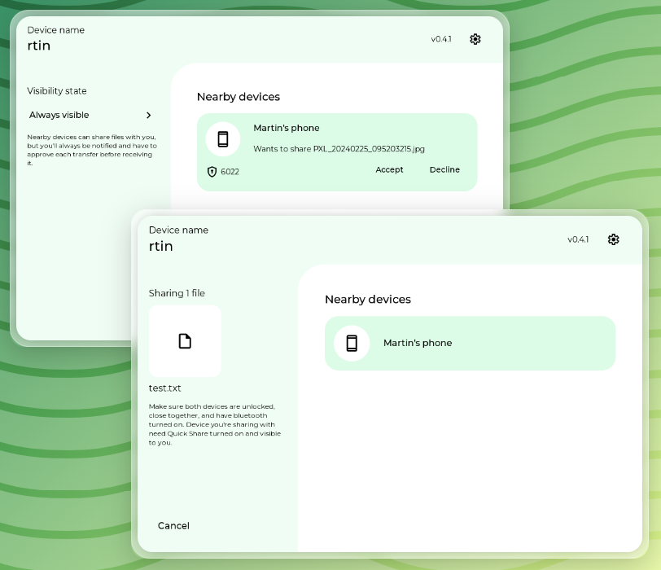

# Fero

Fero is a desktop file-sharing app for Linux and macOS that interoperates with Android's Nearby Share / Quick Share protocol.

Fero started as a fork of [RQuickShare](https://github.com/Martichou/rquickshare) by Martin Andre. The original project provided the core Rust and Tauri implementation this project is based on.



## Installation

Download the latest release for your platform from this repository's releases page.

Important notes:

- Linux builds include the minimum supported GLIBC version in the package name.
- You can check your GLIBC version with `ldd --version`.
- Earlier RQuickShare releases had separate `main` and `legacy` builds. Fero continues from the newer Tauri-based codebase.

### macOS

Install the `.dmg`.

macOS may require you to allow the app under `System Settings > Privacy & Security`.

### Linux

Fero requires one of the following libraries to be installed:

- `libayatana-appindicator`
- `libappindicator3`

The packaged installers should install those dependencies automatically. If that does not happen, install them manually with your distribution's package manager.

#### Debian / Ubuntu

```bash
sudo dpkg -i fero_${VERSION}.deb
```

#### RPM

```bash
sudo rpm -i fero-${VERSION}.rpm
```

#### DNF

```bash
sudo dnf install fero-${VERSION}.rpm
```

#### AppImage

```bash
chmod +x fero_${VERSION}.AppImage
./fero_${VERSION}.AppImage
```

## Limitations

- Wi-Fi LAN only. Your devices need to be on the same network for file sharing to work.

## FAQ

### My Android device doesn't see my laptop

Make sure both devices are on the same Wi-Fi network. mDNS traffic must be allowed on the network; some public networks block it.

### My laptop doesn't see my Android device

Android does not always broadcast its mDNS service, even when Quick Share is set to "Everyone".

On Linux, Fero broadcasts a Bluetooth advertisement so Android reveals its mDNS service. Bluetooth must be available and enabled for this discovery path.

As a workaround, use the [Files by Google](https://play.google.com/store/apps/details?id=com.google.android.apps.nbu.files) app and open the Nearby Share tab.

You can also create a shortcut to one of these Android intents:

- Activity: `com.google.android.gms.nearby.sharing.ReceiveSurfaceActivity`
- Action: `com.google.android.gms.RECEIVE_NEARBY`
- MIME type: `*/*`

Samsung Quick Share behavior may differ from Google's implementation, so the workaround may not work on every device.

### When sharing a file, my phone appears and disappears

This is expected when discovery depends on Bluetooth. Android may de-register its mDNS service and reveal itself again only after it sees another nearby-sharing signal.

### Once I close the app, it won't reopen

Check whether Fero is still running:

```bash
ps aux | grep fero
```

By default, closing the window may leave the app running in the system tray. You can change this inside the app by selecting "Stop app on close".

### My firewall is blocking the connection

Configure a static port by editing the app settings file:

```bash
# Linux
vim ~/.local/share/io.github.swarnimcodes.fero/.settings.json

# macOS
vim ~/Library/Application\ Support/io.github.swarnimcodes.fero/.settings.json
```

Add a port while keeping the JSON valid:

```json
{
	"port": 12345
}
```

By default, the operating system chooses a random port.

### The app opens with a blank window on Linux

Some NVIDIA setups can hit a WebKit rendering issue. Start Fero with:

```bash
env WEBKIT_DISABLE_COMPOSITING_MODE=1 fero
```

## License

Fero is licensed under the GNU General Public License v3.0 or later. See [LICENSE](LICENSE).

This repository is a modified version of RQuickShare. The original work is copyright Martin Andre and contributors; Fero modifications are copyright Swarnimcodes and contributors.

## Credits

Fero builds on:

- [RQuickShare](https://github.com/Martichou/rquickshare) by Martin Andre
- [NearDrop](https://github.com/grishka/NearDrop)
- [QNearbyShare](https://github.com/vicr123/QNearbyShare)

## Contributing

Pull requests are welcome. For major changes, please open an issue first to discuss the proposed change.
